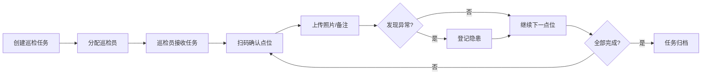
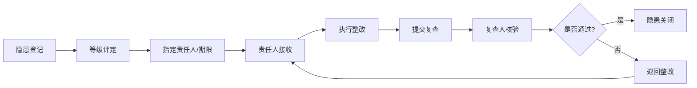

## 1. 产品概述

消防巡检管理平台是面向园区物业和安全主管的日常消防管理工具，旨在解决传统消防巡检流程纸质化、效率低、追溯难等问题，通过数字化手段实现全流程闭环管理。

- **目标用户**：园区物业管理人员、消防安全主管、巡检员、整改责任人
- **核心价值**：提高巡检效率、确保隐患闭环、实现数据可追溯、满足消防合规要求

## 2. 核心功能

### 2.1 用户角色

| 角色 | 注册方式 | 核心权限 |
|------|---------|---------|
| 安全主管 | 系统分配 | 全局数据查看、任务派发、隐患审批、报表导出、系统配置 |
| 物业管理员 | 系统分配 | 建筑档案管理、设备台账维护、整改跟踪、演练记录 |
| 巡检员 | 系统分配 | 接收任务、扫码巡检、上传照片、登记隐患 |
| 整改责任人 | 系统分配 | 接收整改通知、提交整改措施、申请复查 |

### 2.2 功能模块

1. **总览页面**：数据看板、楼栋风险分布、待办任务提醒、近期预警
2. **建筑档案页面**：楼栋信息管理、楼层平面图、风险等级评定、附属设施
3. **设备台账页面**：灭火器管理、喷淋系统、消火栓、烟感探测器、检查周期设置
4. **巡检任务页面**：任务创建派发、巡检点位、扫码确认、照片上传、备注记录
5. **隐患整改页面**：隐患登记、等级评定、责任人指派、期限跟踪、复查关闭
6. **演练记录页面**：演练计划、签到记录、演练评语、照片归档、效果评估
7. **统计报表页面**：逾期统计、部门排名、月报导出、历史变更、待办提醒汇总

### 2.3 页面详情

| 页面名称 | 模块名称 | 功能描述 |
|---------|---------|----------|
| 总览 | 数据看板 | 统计在管楼栋数、设备总数、本月巡检完成率、待处理隐患数，以卡片和进度环展示 |
| 总览 | 楼栋风险分布 | 以彩色热力地图/卡片矩阵形式展示各楼栋风险等级（红/橙/黄/蓝） |
| 总览 | 待办任务提醒 | 按优先级列出待巡检、待整改、待复查事项，点击跳转至对应页面 |
| 总览 | 近期预警 | 展示设备即将过期、隐患即将超期、巡检遗漏等预警信息 |
| 建筑档案 | 楼栋列表 | 以表格形式展示楼栋信息，支持筛选、搜索、分页 |
| 建筑档案 | 楼栋详情 | 展示楼栋基本信息、楼层数、建筑面积、消防设施、风险等级、历史变更 |
| 建筑档案 | 风险评定 | 支持手动或自动评定风险等级，记录评定依据和变更历史 |
| 设备台账 | 设备分类 | 按灭火器/喷淋/消火栓/烟感等分类筛选，Tab 切换 |
| 设备台账 | 设备列表 | 展示设备编号、位置、型号、有效期、上次检查日期、下次检查日期 |
| 设备台账 | 检查周期配置 | 为每类设备设置检查周期（月度/季度/半年/年度） |
| 设备台账 | 设备维护 | 新增、编辑、报废设备，记录维护日志 |
| 巡检任务 | 任务列表 | 展示待办/进行中/已完成任务，支持按时间、区域、巡检员筛选 |
| 巡检任务 | 任务创建 | 选择巡检范围、点位、巡检员、截止日期，设置巡检频率 |
| 巡检任务 | 点位巡检 | 扫码确认点位，上传现场照片，填写检查项和备注 |
| 巡检任务 | 巡检历史 | 查看历史巡检记录、照片、异常情况 |
| 隐患整改 | 隐患列表 | 按等级（重大/较大/一般）、状态（待整改/整改中/待复查/已关闭）筛选 |
| 隐患整改 | 隐患登记 | 记录隐患位置、描述、照片、等级评定、责任人、整改期限 |
| 隐患整改 | 整改跟踪 | 展示整改进度、延期申请、整改措施、复查结果 |
| 隐患整改 | 复查关闭 | 复查人签字确认，上传复查照片，关闭或退回隐患 |
| 演练记录 | 演练列表 | 展示历史演练记录，包含时间、地点、类型、参与人数 |
| 演练记录 | 演练详情 | 演练方案、签到表（人员签到时间）、现场照片、评语记录 |
| 演练记录 | 新建演练 | 创建演练计划，设置演练类型（消防/疏散/综合）、时间、地点 |
| 统计报表 | 逾期统计 | 按部门统计巡检逾期数、整改逾期数、设备过期数，柱状图展示 |
| 统计报表 | 月报导出 | 生成月度消防管理报告（PDF/Excel），包含巡检、隐患、演练数据 |
| 统计报表 | 历史变更 | 展示设备、楼栋、隐患等数据的变更日志，支持按时间和操作人筛选 |
| 统计报表 | 待办提醒汇总 | 全局待办汇总，支持一键导出提醒清单 |

## 3. 核心流程

### 3.1 巡检任务流程
安全主管创建巡检任务，指定巡检员和范围 → 巡检员接收任务 → 逐个点位扫码确认 → 上传检查照片和备注 → 发现异常自动触发隐患登记 → 任务完成归档

### 3.2 隐患整改流程
巡检员/管理员登记隐患 → 评定等级并指定责任人 → 责任人执行整改 → 提交复查申请 → 复查人现场核验 → 通过则关闭，不通过则退回

## 4. 用户界面设计

### 4.1 设计风格
- **主色调**：消防红 `#DC2626`（警示、紧急）、工业蓝 `#1E40AF`（专业、可信）
- **辅助色**：警示橙 `#F97316`（提醒）、安全绿 `#059669`（正常）、风险黄 `#EAB308`（注意）
- **中性色**：深灰 `#1F2937`、中灰 `#6B7280`、浅灰 `#F3F4F6`、纯白 `#FFFFFF`
- **按钮风格**：直角微圆角（4px），主色按钮悬停加深 10%，禁用态降低透明度
- **字体选择**：正文使用 "Noto Sans SC"（思源黑体），数据展示使用 "JetBrains Mono"
- **字号体系**：标题 18px/20px，正文 14px，辅助文字 12px，数据数字 20px-32px
- **布局风格**：左侧固定导航栏 + 顶部状态栏 + 右侧内容区，卡片式模块化布局
- **图标风格**：线性图标（lucide-react），20px 为主，状态色填充
- **设计基调**：工业风 + 专业级仪表盘，强调数据可视化和状态辨识度

### 4.2 页面设计概述

| 页面名称 | 模块名称 | UI 元素 |
|---------|---------|--------|
| 总览 | 数据看板 | 4 张大指标卡片（带图标和趋势箭头），渐变色背景，数字 32px 加粗 |
| 总览 | 风险分布 | 楼栋卡片矩阵，按风险等级显示边框色和背景色，悬停浮起效果 |
| 总览 | 待办提醒 | 列表式卡片，左侧色条标识优先级，右侧显示截止日期倒计时 |
| 总览 | 近期预警 | 时间轴布局，节点图标区分预警类型，滚动展示 |
| 建筑档案 | 楼栋列表 | 数据表格，支持列宽调整，行悬停高亮，风险等级列用彩色徽章 |
| 建筑档案 | 楼栋详情 | 抽屉式侧边栏弹出，分 Tab 展示基本信息/设施/变更历史 |
| 设备台账 | 设备分类 | 顶部 Tab 切换（带下划线动画），右侧显示检查周期配置按钮 |
| 设备台账 | 设备列表 | 卡片网格布局，每张设备卡显示照片缩略图、状态指示灯、有效期进度条 |
| 巡检任务 | 任务列表 | 折叠式表格，展开可看点位列表和巡检进度条 |
| 巡检任务 | 扫码巡检 | 移动端友好布局，大按钮扫码，照片上传缩略图网格，星级评价组件 |
| 隐患整改 | 隐患看板 | 四象限看板（待整改/整改中/待复查/已关闭），卡片可拖拽切换状态 |
| 隐患整改 | 详情页 | 时间线展示整改全流程，左侧信息面板，右侧操作区 |
| 演练记录 | 演练详情 | 三栏布局：基本信息 / 签到表（搜索+勾选） / 评语与照片 |
| 统计报表 | 图表区域 | ECharts 柱状图+折线图组合，可切换维度（按部门/按月份） |
| 统计报表 | 导出面板 | 表单式参数配置，导出进度条，下载按钮带文件图标 |

### 4.3 响应式设计
- **设计优先级**：Desktop-first（桌面端优先），主适配 1920×1080 和 1440×900
- **平板适配**：≤1280px 时侧边栏收起为图标模式，内容区自适应
- **移动适配**：≤768px 时底部 Tab 导航替代侧边栏，表格转为卡片列表，扫码页优化触控区域
- **触控优化**：所有可点击元素最小尺寸 44×44px，表单输入框增加垂直内边距

### 4.4 动效与交互
- 页面切换：左侧滑入，180ms ease-out
- 数据卡片：入场依次淡入（stagger 60ms）
- 悬停效果：卡片浮起 + 阴影加深（translateY -2px, box-shadow 增大）
- 状态变更：绿色对勾动画 / 红色闪烁警示（2次 pulse）
- 进度条：从左至右填充动画（600ms ease-out）
