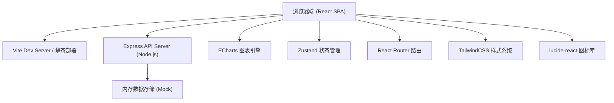
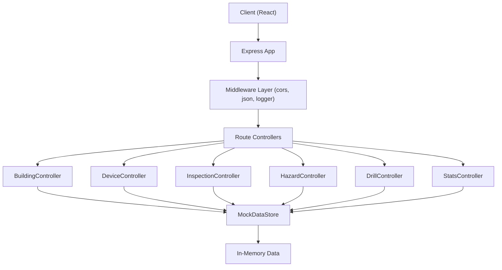
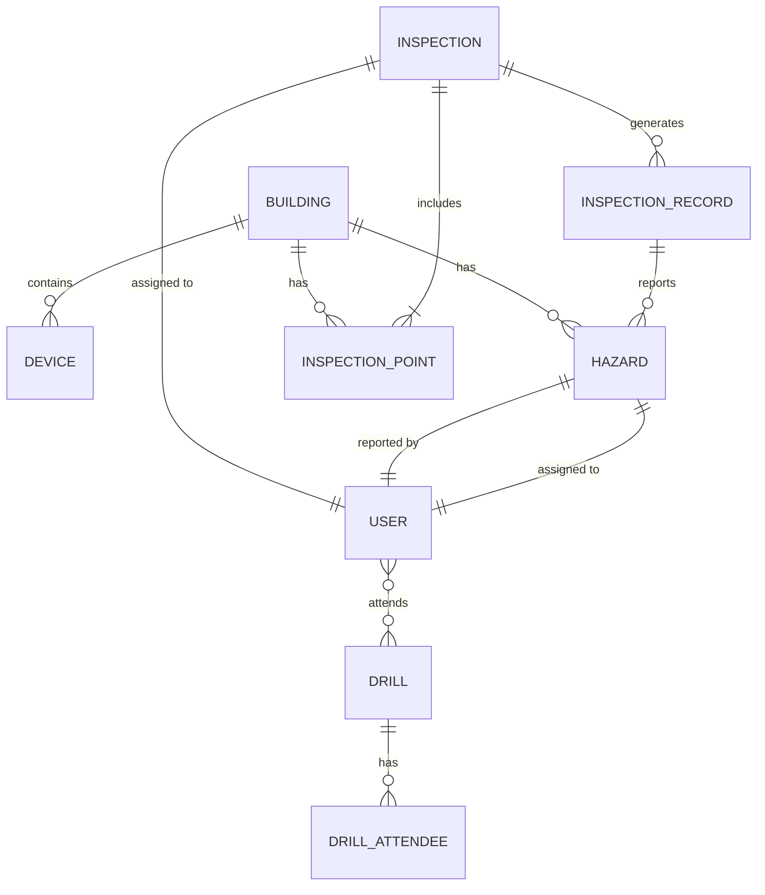

## 1. 架构设计



## 2. 技术描述

- **前端框架**：React@18 + TypeScript@5
- **构建工具**：Vite@5
- **路由系统**：react-router-dom@6
- **状态管理**：zustand@4
- **样式方案**：TailwindCSS@3 + CSS 变量
- **UI 图标**：lucide-react@0.400
- **图表库**：echarts@5 + echarts-for-react
- **初始化模板**：react-express-ts（含前后端一体化）
- **后端框架**：Express@4 + TypeScript
- **数据方案**：Mock 数据 + 内存数据存储（演示用）
- **代码规范**：TypeScript 严格模式

## 3. 路由定义

| 路由路径 | 页面组件 | 页面用途 |
|---------|---------|---------|
| `/` | `Dashboard` | 总览页面 - 数据看板、风险预警、待办提醒 |
| `/buildings` | `BuildingList` | 建筑档案 - 楼栋列表、风险等级 |
| `/buildings/:id` | `BuildingDetail` | 楼栋详情 - 详细信息、设施、变更 |
| `/devices` | `DeviceList` | 设备台账 - 分类展示、周期配置 |
| `/inspections` | `InspectionList` | 巡检任务 - 任务管理、派发 |
| `/inspections/:id` | `InspectionDetail` | 巡检执行 - 扫码、照片、备注 |
| `/hazards` | `HazardList` | 隐患整改 - 看板、列表、筛选 |
| `/hazards/:id` | `HazardDetail` | 隐患详情 - 整改流程、复查 |
| `/drills` | `DrillList` | 演练记录 - 演练列表、管理 |
| `/drills/:id` | `DrillDetail` | 演练详情 - 签到、评语、照片 |
| `/reports` | `Reports` | 统计报表 - 逾期统计、月报导出、历史变更 |

## 4. API 定义

### 4.1 通用响应结构

```typescript
interface ApiResponse<T> {
  code: number;
  message: string;
  data: T;
  timestamp: number;
}

interface PagedResponse<T> {
  list: T[];
  total: number;
  page: number;
  pageSize: number;
}
```

### 4.2 数据类型定义

```typescript
// 楼栋
interface Building {
  id: string;
  name: string;
  address: string;
  floors: number;
  area: number;
  riskLevel: 'high' | 'medium' | 'low' | 'normal';
  buildYear: number;
  fireFacilities: string[];
  lastInspection: string;
  createdAt: string;
  updatedAt: string;
}

// 设备
interface Device {
  id: string;
  buildingId: string;
  buildingName: string;
  location: string;
  type: 'fire_extinguisher' | 'sprinkler' | 'fire_hydrant' | 'smoke_detector' | 'fire_alarm';
  model: string;
  serialNumber: string;
  installDate: string;
  lastCheckDate: string;
  nextCheckDate: string;
  checkCycle: 'monthly' | 'quarterly' | 'half_year' | 'yearly';
  status: 'normal' | 'warning' | 'expired' | 'maintenance';
  pressureLevel?: 'normal' | 'low' | 'high';
  expireDate?: string;
  remark?: string;
}

// 巡检任务
interface Inspection {
  id: string;
  title: string;
  type: 'daily' | 'weekly' | 'monthly' | 'special';
  status: 'pending' | 'in_progress' | 'completed' | 'overdue';
  inspectorId: string;
  inspectorName: string;
  buildingIds: string[];
  pointIds: string[];
  startDate: string;
  endDate: string;
  completeDate?: string;
  progress: number;
  createdAt: string;
  creatorName: string;
}

// 巡检点位
interface InspectionPoint {
  id: string;
  buildingId: string;
  location: string;
  qrCode: string;
  items: string[];
  lastInspectDate?: string;
}

// 巡检记录
interface InspectionRecord {
  id: string;
  inspectionId: string;
  pointId: string;
  inspectorId: string;
  scanTime: string;
  photos: string[];
  remark?: string;
  items: { name: string; result: 'pass' | 'fail' | 'na'; remark?: string }[];
  hasHazard: boolean;
}

// 隐患
interface Hazard {
  id: string;
  title: string;
  description: string;
  level: 'major' | 'larger' | 'general';
  status: 'pending' | 'rectifying' | 'reviewing' | 'closed';
  buildingId: string;
  location: string;
  photos: string[];
  reporterId: string;
  reporterName: string;
  reportTime: string;
  responsibleId: string;
  responsibleName: string;
  responsibleDept: string;
  deadline: string;
  rectifyMeasures?: string;
  rectifyDate?: string;
  rectifyPhotos?: string[];
  reviewerId?: string;
  reviewerName?: string;
  reviewDate?: string;
  reviewResult?: 'pass' | 'fail';
  reviewRemark?: string;
  history: { status: string; time: string; operator: string; remark?: string }[];
}

// 演练
interface Drill {
  id: string;
  title: string;
  type: 'fire' | 'evacuation' | 'comprehensive';
  status: 'planned' | 'ongoing' | 'completed';
  date: string;
  location: string;
  duration: number;
  participants: number;
  signedParticipants: string[];
  photos: string[];
  evaluation: string;
  organizer: string;
  createdAt: string;
}

// 签到记录
interface DrillAttendee {
  id: string;
  drillId: string;
  userId: string;
  userName: string;
  dept: string;
  signTime: string;
}

// 变更日志
interface ChangeLog {
  id: string;
  module: string;
  recordId: string;
  action: 'create' | 'update' | 'delete';
  fieldName?: string;
  oldValue?: string;
  newValue?: string;
  operatorId: string;
  operatorName: string;
  operateTime: string;
}

// 统计数据
interface OverdueStats {
  dept: string;
  inspectionOverdue: number;
  hazardOverdue: number;
  deviceExpired: number;
}

interface MonthlyReport {
  month: string;
  inspectionTotal: number;
  inspectionCompleted: number;
  hazardTotal: number;
  hazardClosed: number;
  drillCount: number;
  deviceCheckCount: number;
}

// 用户
interface User {
  id: string;
  name: string;
  role: 'director' | 'manager' | 'inspector' | 'rectifier';
  dept: string;
  phone: string;
  email: string;
}
```

### 4.3 接口列表

| 方法 | 路径 | 说明 |
|-----|------|-----|
| GET | `/api/buildings` | 获取楼栋列表（支持筛选分页） |
| GET | `/api/buildings/:id` | 获取楼栋详情 |
| POST | `/api/buildings` | 新增楼栋 |
| PUT | `/api/buildings/:id` | 更新楼栋信息 |
| DELETE | `/api/buildings/:id` | 删除楼栋 |
| GET | `/api/devices` | 获取设备列表（支持类型筛选） |
| GET | `/api/devices/:id` | 获取设备详情 |
| POST | `/api/devices` | 新增设备 |
| PUT | `/api/devices/:id` | 更新设备信息 |
| POST | `/api/devices/check-cycle` | 批量更新检查周期 |
| GET | `/api/inspections` | 获取巡检任务列表 |
| POST | `/api/inspections` | 创建巡检任务 |
| GET | `/api/inspections/:id` | 获取任务详情（含点位） |
| POST | `/api/inspections/:id/records` | 提交巡检记录 |
| GET | `/api/hazards` | 获取隐患列表（支持等级/状态筛选） |
| POST | `/api/hazards` | 登记隐患 |
| PUT | `/api/hazards/:id` | 更新隐患（指派/整改/复查） |
| GET | `/api/drills` | 获取演练列表 |
| POST | `/api/drills` | 创建演练 |
| GET | `/api/drills/:id` | 获取演练详情（含签到） |
| POST | `/api/drills/:id/sign` | 签到 |
| GET | `/api/stats/overview` | 总览数据 |
| GET | `/api/stats/overdue` | 逾期统计（按部门） |
| GET | `/api/stats/monthly` | 月度统计 |
| GET | `/api/stats/changelogs` | 变更日志 |
| GET | `/api/reports/monthly/export` | 导出月报 |
| GET | `/api/users` | 获取用户列表 |

## 5. 服务器架构图



## 6. 数据模型

### 6.1 实体关系图



### 6.2 核心表结构说明

**buildings 表**
- id: 主键 UUID
- name: 楼栋名称
- address: 地址
- floors: 楼层数
- area: 建筑面积（㎡）
- riskLevel: 风险等级
- buildYear: 建成年份
- fireFacilities: 消防设施（JSON 数组）
- createdAt/updatedAt: 时间戳

**devices 表**
- id: 主键 UUID
- buildingId: 关联楼栋
- type: 设备类型
- location: 位置描述
- model/sn: 型号/序列号
- installDate: 安装日期
- lastCheckDate/nextCheckDate: 检查日期
- checkCycle: 检查周期
- status: 状态
- pressureLevel/expireDate: 灭火器特有字段

**inspections 表**
- id: 主键
- title/type: 标题/类型
- status: 状态
- inspectorId/inspectorName: 巡检员
- buildingIds/pointIds: 关联楼栋和点位
- startDate/endDate: 起止日期
- progress: 进度百分比

**hazards 表**
- id: 主键
- title/description: 标题/描述
- level: 等级（重大/较大/一般）
- status: 状态
- buildingId/location: 位置
- reporterId: 上报人
- responsibleId/dept: 责任人/部门
- deadline: 整改期限
- rectifyMeasures: 整改措施
- reviewerId/result: 复查信息
- history: 状态变更历史（JSON）
